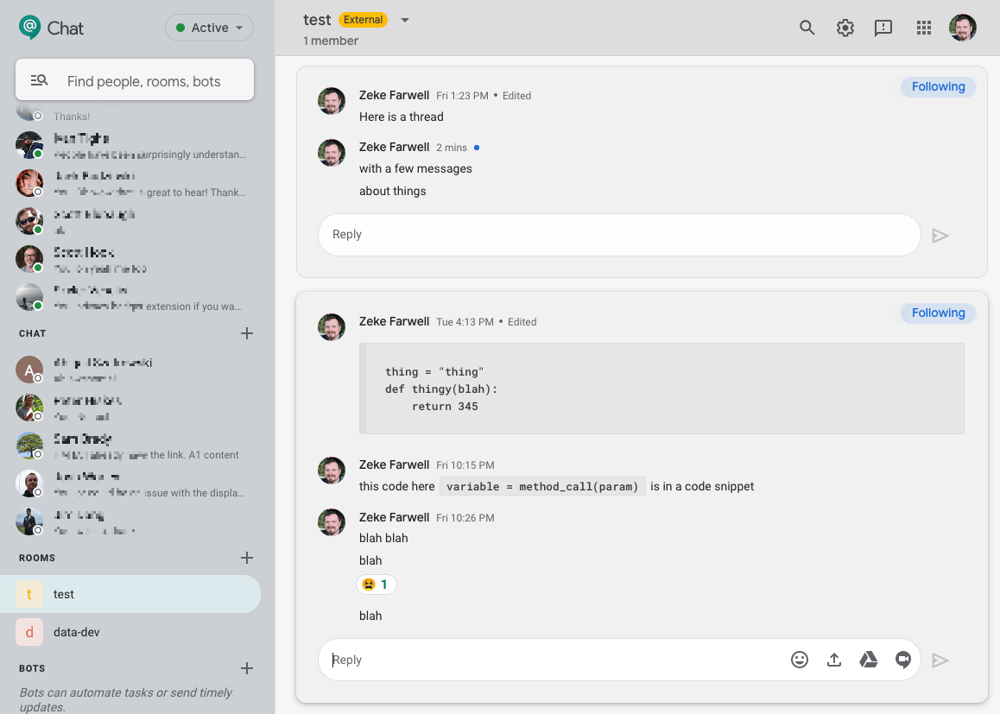

# Google Chat Gray Theme

A theme for Google Chat replacing the blinding white default UI with shades of gray that are less painful to look at.

## Installation

1. Get [Stylus](https://github.com/openstyles/stylus/) if you don't have it already:
    - [Chrome Extension](https://chrome.google.com/webstore/detail/stylus/clngdbkpkpeebahjckkjfobafhncgmne)
    - [Firefox AddOn](https://addons.mozilla.org/en-US/firefox/addon/styl-us/)
2. [Click here to install the User CSS file](https://github.com/zekefarwell/gchat-gray-theme/raw/master/gchat-gray-theme.user.css)
